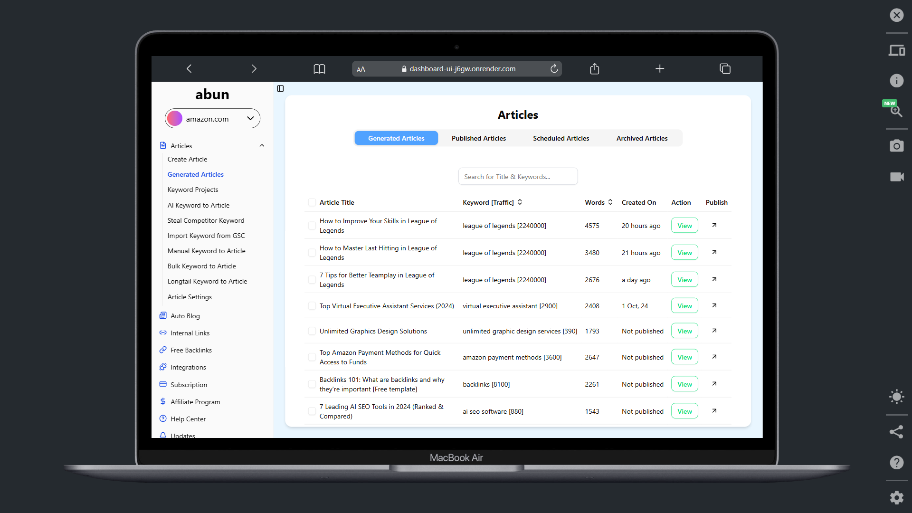
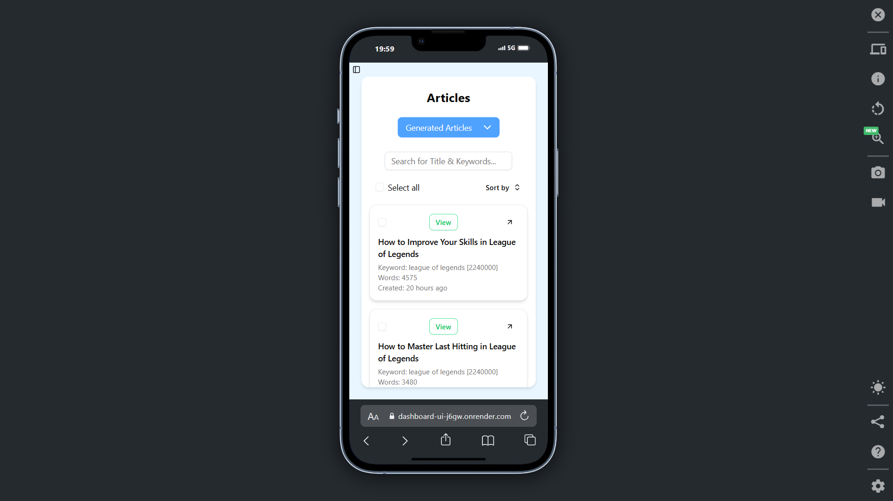

# 📊 Dashboard UI

A professional, fully responsive dashboard interface built with **React**, **Tailwind CSS**, and **Shadcn/ui**. This project features a collapsible sidebar, a dynamic article management table, and a modular structure ideal for scalable applications.

> 🌐 [**Live Demo**](https://dashboard-ui-j6gw.onrender.com)  

---

## 📸 Preview

 
---
 
---

## 🚀 Features

- ✅ Responsive layout (desktop & mobile)
- ✅ Collapsible sidebar with dropdown menus
- ✅ Articles table with sorting and skeleton loading
- ✅ Route-based page architecture
- ✅ Shadcn/ui components for accessibility
- ✅ Tailwind CSS for fast, utility-first styling
- ✅ Clean code structure for easy scalability

---

## 🧠 Tech Stack

- **React** (Vite)
- **Tailwind CSS**
- **Shadcn/ui**
- **React Router**

---

## 📁 Project Structure
```js
├── public/
├── src/
│ ├── assets/
│ ├── components/
│ │ └── ui/ 
│ ├── hooks/
│ ├── lib/
│ ├── Pages
│ ├── App.jsx
│ └── main.jsx
├── index.html
├── package.json
├── tailwind.config.js
└── vite.config.js
```


---

## 📦 Installation

Follow these steps to run the project locally:

```bash
# 1. Clone the repository
git clone https://github.com/soubhik09/Dashboard-Ui.git
cd Dashboard-Ui

# 2. Install dependencies
npm install

# 3. Start development server
npm run dev
```
> The app will run at http://localhost:5173

## ✨ Customization Tips

- **Modify sidebar links in** `src/components/ui/sidebar.jsx`
- **Add new routes in** `src/Pages/Layout.jsx`
- **Extend article logic in** `src/components/ui/ArticlesTable.jsx`

## 🙋‍♂️ Author
- Built by [@soubhik09](https://github.com/soubhik09)

- If you found this useful, feel free to star ⭐ the repository!